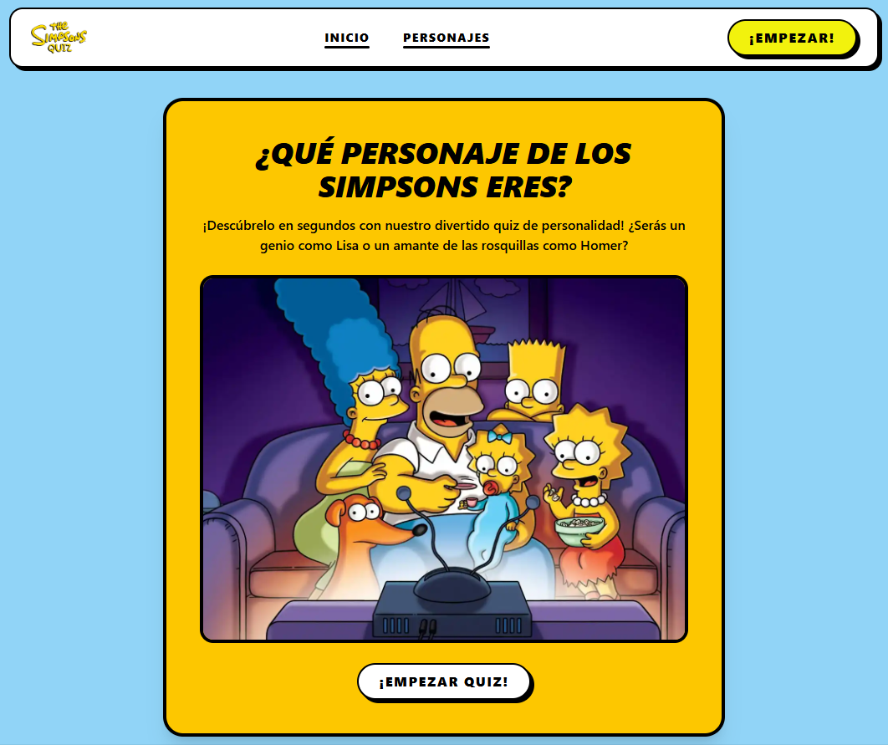

<div align="center">
  <a href="https://the-simpsons-quiz.vercel.app/">
    
  </a>
  <p />
  <p>
    <b>
      An interactive web quiz that determines which The Simpsons character you are. Built with Astro + React and deployed on Vercel.
    </b>
  </p>

<p align="center">
    <a href="https://the-simpsons-quiz.vercel.app/">Live Demo</a>
    <span>&nbsp;&nbsp;✦&nbsp;&nbsp;</span>
    <a href="#-introduction">Introduction</a>
    <span>&nbsp;&nbsp;✦&nbsp;&nbsp;</span>
    <a href="#-stack">Stack</a>
    <span>&nbsp;&nbsp;✦&nbsp;&nbsp;</span>
    <a href="#-features">Features</a>
    <span>&nbsp;&nbsp;✦&nbsp;&nbsp;</span>
    <a href="#-project-structure">Project Structure</a>
    <span>&nbsp;&nbsp;✦&nbsp;&nbsp;</span>
    <a href="#-license">License</a>
</p>



</div>

## 📝 Introduction

Simpsons Quiz is a responsive and interactive personality quiz inspired by The Simpsons.
Users answer a dynamic set of questions, experience a custom animated loading screen, and receive a final character result fetched from an external API.
The project focuses on clean component architecture, modern Astro SSR patterns, and polished UI interactions.

## 🛠️ Stack

- ⚡ [**Astro**](https://astro.build/) – Modern web framework for building fast, server-first applications.
- ⚛️ [**React**](https://react.dev/) – Interactive UI library used for the quiz engine.
- 🟦 [**TypeScript**](https://www.typescriptlang.org/) – JavaScript with static typing for scalable and maintainable code.
- 🎨 [**Tailwind CSS**](https://tailwindcss.com/) – A utility-first CSS framework for rapidly building custom designs.
- ☁️ [**Vercel**](https://vercel.com/) – Serverless deployment and hosting platform.
- 📡 [**The Simpsons API**](https://thesimpsonsapi.com/) – Public API used to fetch character data dynamically.
- 🧹 [**Prettier**](https://prettier.io/) – Opinionated code formatter for consistent code style.

## ✨ Features

- Multi-step interactive quiz
- Randomized question flow
- Animated loading screen with progress bar
- Dynamic character result from API
- Fully responsive design
- Cartoon-inspired UI
- Optimized `.webp` image handling

## 📁 Project Structure

```src/
├── components/
│   ├── quiz/
│   ├── Navbar.astro
│   ├── Footer.astro
│   └── ResultCard.astro
│
├── layouts/
│   ├── BaseLayout.astro
│   └── QuizLayout.astro
│
├── pages/
│   ├── index.astro
│   ├── quiz.astro
│   ├── loading.astro
│   └── result.astro
│
└── data/
    ├── questions.ts
    └── characters.ts
```

## 🔑 License

- This project is licensed under the [MIT](https://github.com/pheralb/svgl/blob/main/LICENSE) License.
